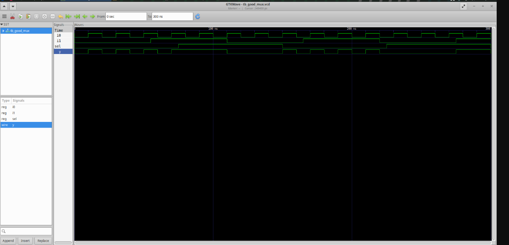
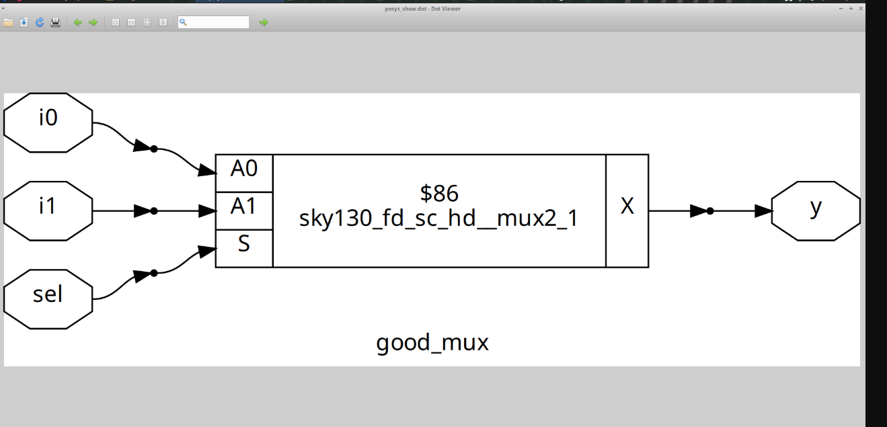

# Day 1: Introduction to Verilog RTL Design & Synthesis 🚀

Welcome to Day 1! Today, we took our first steps into the world of digital design, covering the fundamental tools and concepts needed to kick off an RTL-to-GDS2 workflow. We learned how to use a simulator and took on our first lab to simulate a simple circuit.

### **1. What is a Simulator, Design, and Testbench?**

* **Design:** 🎨 The **Verilog code** that describes the logic and functionality of the circuit you want to build. This is the heart of your project!
* **Testbench:** 🧪 A separate Verilog module written to test the design. It's like a test rig in a lab—it applies input signals to your design and checks if the outputs are correct.
* **Simulator:** 💻 A program that runs the design and testbench. It helps you verify that your design behaves as expected before you move on to physical implementation.

---

### **2. Getting Started with iverilog**

**Iverilog** is a powerful, open-source Verilog simulator. This is how a typical simulation flow looks:
* First, we use **iverilog** to compile the design and testbench files into an executable.
* Next, we run the executable with the **vvp** command to simulate the circuit and generate a waveform file (`.vcd`).
* Finally, we use a waveform viewer like **gtkwave** to visualize the simulation results.
* (iamreddy01/week1/Day_1/gtkwave mux.png)

---

### **3. Lab: Simulating a 2 to 1 Multiplexer**

For our first lab, we designed and simulated a 2-to-1 multiplexer. Here are the steps we followed:

**Step 1: Clone the Workshop Repository**
```bash
git clone https://github.com/kunalg123/sky130RTLDesignAndSynthesisWorkshop.git
cd sky130RTLDesignAndSynthesisWorkshop/verilog_files
```
#### Step 2: Install Required Tools
```bash
sudo apt install iverilog 
```
```bash
sudo apt install gtkwave
```
#### Step 3: Simulate the Design

```bash

iverilog good_mux.v tb_good_mux.v

```

```bash
./a.out

```

```bash
gtkwave tb_good_mux.vcd

```
Above commands flow lets you compile, run, and view the waveforms.
* 


#### step 4. Verilog Code Analysis
Here’s the Verilog code for the 2-to-1 multiplexer (good_mux_v.v), which we designed for this lab.
* 2 to 1 Multiplexer
```bash
    module good_mux_v (
    input a, // data input
    input b, // data input
    input s, // select input
    output y // output
);
    assign y = s ? a : b;
endmodule
```
#### step 5. Technology Mapping
After our simulation passed, we learned about synthesis. Synthesis is the process of converting your RTL code into a gate-level netlist using a specific cell library.

**Yosys** is an open-source synthesis tool that we'll be using. It's a fantastic tool that translates your Verilog code into a series of logical gates.
#### What is a "cell library"?
A cell library, or PDK (Process Design Kit), is a collection of predefined logical gates (like AND, OR, NOT) and other standard cells. Each gate has specific characteristics, like size, power consumption, and delay. Yosys chooses the best gates from this library to implement your design.
## Steps for Yosys Flow 
Start Yosys
```bash
yosys
```
Read the liberty 
```bash
read_liberty -lib /address/to/your/sky130/file/sky130_fd_sc_hd__tt_025C_1v80.lib
```
Read the Verilog code
```bash
read_verilog /home/vsduser/VLSI/sky130RTLDesignAndSynthesisWorkshop/verilog_files/good_mux.v
```
Synthesize the design
```bash
synth -top good_mux
```
Technology mapping
```bash
abc -liberty /address/to/your/sky130/file/sky130_fd_sc_hd__tt_025C_1v80.lib
```
Visualize the gate-level netlist
```bash
show
```
After running the synthesis flow, we can visualize the resulting gate-level netlist. 
* 
* **This diagram shows how the logic from our Verilog code is mapped to physical gates.**
* **It's an important step to understand how our high-level design translates into actual hardware.**

That's a wrap on our first day! 
*We've successfully designed, simulated, and synthesized a simple circuit. ✅


