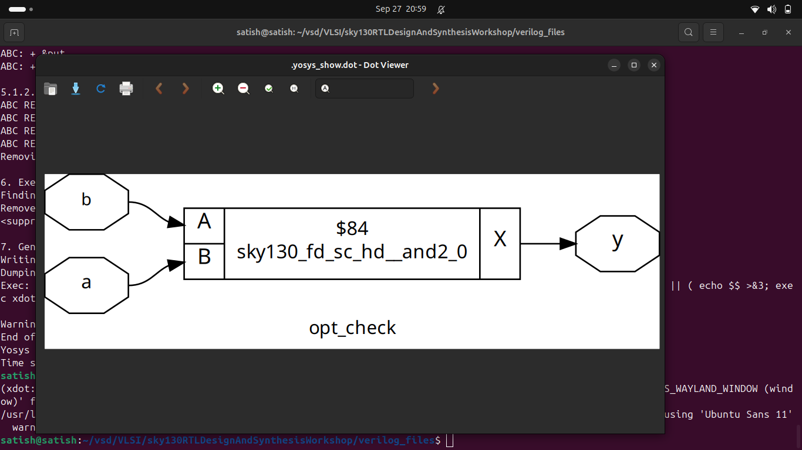
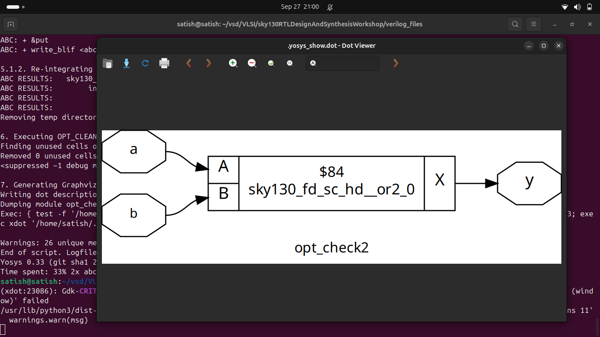
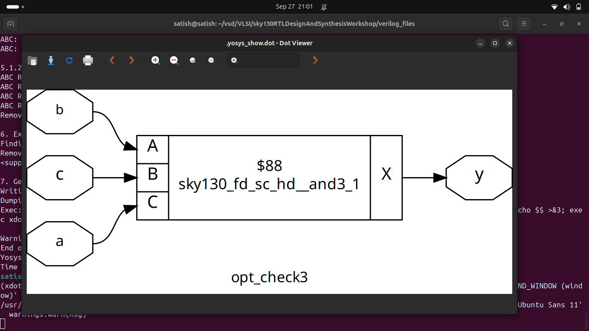
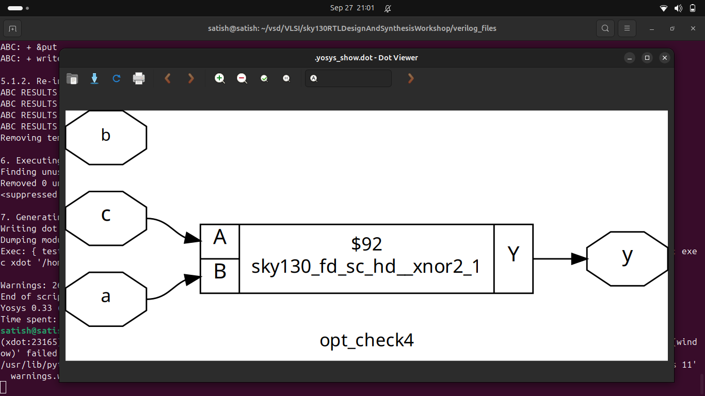
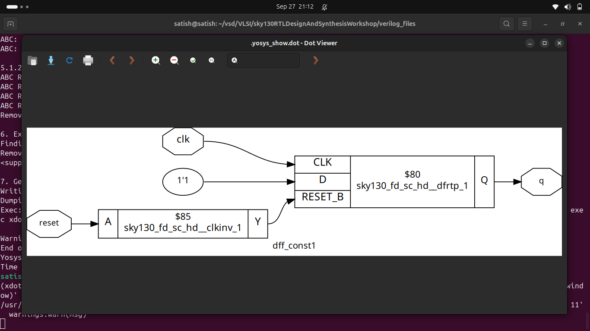
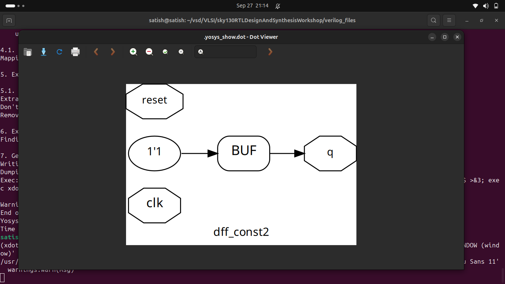

# Day 3: Combinational and Sequential Optimization
Welcome to Day 3 of this workshop! Today we discuss optimization of combinational and sequential circuits, introducing techniques to enhance efficiency and performance.

### 1.Constant Propagation ###
In VLSI design, constant propagation is a compiler optimization technique used to replace variables with their constant values during synthesis. This can simplify design and enhance performance.

**How it works:**
Constant propagation analyzes the design code to identify variables with constant values. These are replaced directly, allowing tools to simplify logic and reduce circuit size.

**Benefits:**

* **Reduced Complexity:** Simpler logic, smaller circuit.
* **Performance Improvement:** Faster execution and reduced delays.
* **Resource Optimization:** Fewer gates or flip-flops required.
* **Constant Propagation Example**

### 2.State Optimization ###
State optimization refines finite state machines (FSMs) to improve efficiency in IC design. It reduces the number of states, optimizes encoding, and minimizes logic.

**How it is done:**

* **State Reduction:** Merge equivalent states using algorithms.
* **State Encoding:** Assign optimal codes to states.
* **Logic Minimization:** Use Boolean algebra or tools for compact equations.
* **Power Optimization:** Techniques like clock gating reduce dynamic power.
### 3. Cloning ###
Cloning duplicates a logic cell or module to optimize performance, reduce power, or improve timing by balancing load or reducing wire length.

**How it’s done:**

* Identify critical paths using analysis tools.
* Duplicate the target cell/module.
* Redistribute connections to balance load.
* Place and route the cloned cell.
* Verify improvement via timing and power analysis.
* Cloning Example

### 4. Retiming ###
Retiming is a design optimization technique that improves circuit performance by repositioning registers (flip-flops) without changing functionality.

**How it is done:**

1.**Graph Representation:** Model circuit as a directed graph.
2.**Register Repositioning:**Move registers to balance path delays.
3.**Constraints Analysis:** Maintain timing and functional equivalence.
4.**Optimization:** Adjust register positions to minimize clock period and optimize power.
### 5. Labs on Optimization ###
### Lab 1
Below is the Verilog code for Lab 1:
```bash
module opt_check (input a , input b , output y);
	assign y = a?b:0;
endmodule
```
### Explanation:

* **assign y = a ? b : 0; means:**
    * **If a is true, y is assigned the value of b.**
    * **If a is false, y is 0.**

Follow the steps from Day 1 Synthesis Lab and add the following between abc -liberty and synth -top:

opt_clean -purge



### Lab 2
Verilog code:
```bash
module opt_check2 (input a , input b , output y);
	assign y = a?1:b;
endmodule
```
### Code Analysis:

* **Acts as a multiplexer:**
    * **y = 1 if a is true.**
    * **y = b if a is false.**



### Lab 3
Verilog code:
```bash
module opt_check2 (input a , input b , output y);
	assign y = a?1:b;
endmodule
```
### Functionality:
2-to-1 multiplexer; y = a ? 1 : b (outputs 1 when a is true, otherwise b).



### Lab 4
Verilog code:
```bash
module opt_check4 (input a , input b , input c , output y);
 assign y = a?(b?(a & c ):c):(!c);
 endmodule
```
### Functionality:

* **Three inputs (a, b, c), output y.**
* **Nested ternary logic:**
    * **If a = 1, y = c.**
    * **If a = 0, y = !c.**
* **Logic simplifies to:**
    * **y = a ? c : !c**


### Lab 5
Verilog code:
```bash
module dff_const1(input clk, input reset, output reg q);
always @(posedge clk, posedge reset)
begin
	if(reset)
		q <= 1'b0;
	else
		q <= 1'b1;
end
endmodule
```
### Functionality:

* **D flip-flop with:**
    * **Asynchronous reset to 0**
    * **Loads constant 1 when not in reset**


### Lab 6
Verilog code:
```bash
module dff_const2(input clk, input reset, output reg q);
always @(posedge clk, posedge reset)
begin
	if(reset)
		q <= 1'b1;
	else
		q <= 1'b1;
end
endmodule
```
### Functionality:

* **D flip-flop always sets output q to 1 (regardless of reset or clock).**


### Summary
* **Focus: Optimization techniques for combinational and sequential circuits in digital design, with practical Verilog labs.**

* **Topics Covered:**

  i.**Constant Propagation:** Replacing variables with constant values to simplify logic and improve circuit efficiency.
  ii.**State Optimization:** Reducing states and optimizing encoding in finite state machines to use less logic and power.
  iii.**Cloning:** Duplicating logic cells/modules to improve timing and balance load.
   
  iv. **Retiming:** Repositioning registers in a circuit to enhance performance without altering its function.
  
  **Labs: Six practical Verilog labs illustrate these concepts, including examples of combinational logic optimizations and D flip-flop behaviors, each with code snippets and output images.**
